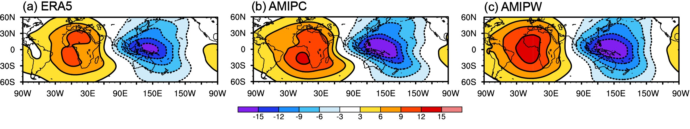
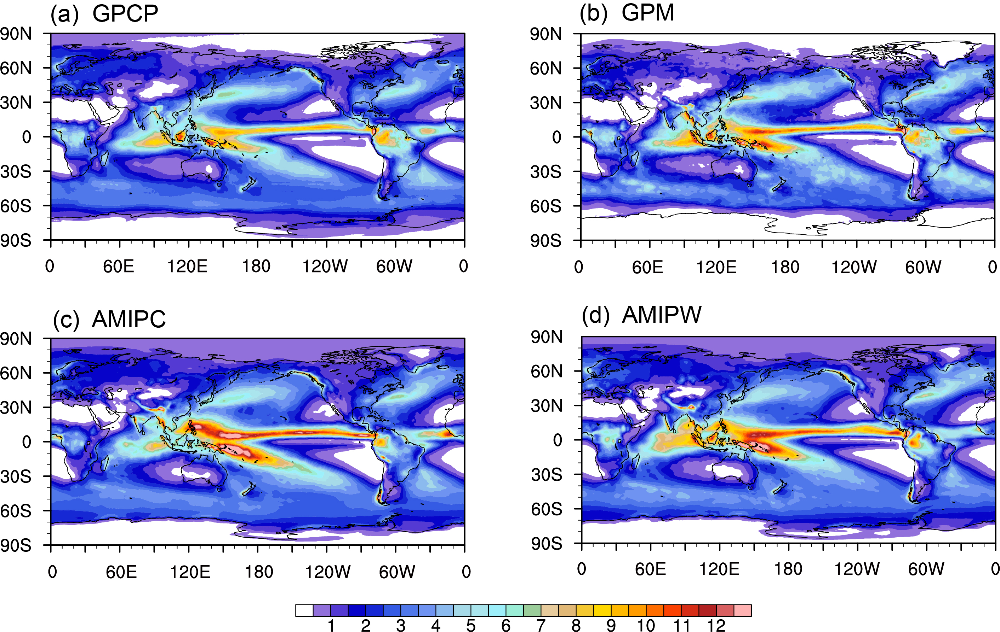

气候模式
================
【1】模式介绍
----------------
全球-区域一体化预测系统（Global-to-Regional Integrated forecast SysTem；GRIST）是近年来国内模式开发团队独立设计、自主研发的新一代非结构化网格天气-气候一体化模式系统。传统意义上，数值天气预报（numerical weather prediction；NWP）在时间上只需积分数天至数十天，而气候模拟往往需要积分数年乃至数十年以上；除此之外，气候模拟在分辨率、物理-动力耦合等过程上也都有别于NWP。而就GRIST系统而言，天气模式与气候模式共享统一的模式框架和动力内核，可以最大限度地使用同一个模式配置来满足大多数天气、气候预测业务的需求。

目前，GRIST包含2套物理参数化方案包，其分别是中至云尺度天气物理包（PhysW；可用于天气-气候预测）与传统气候物理包（PhysC；可用于长期气候预测与气候变化）。本模块将基于这两套物理包，分别介绍如何运行具有真实下垫面的完整大气AMIP（Atmospheric Model Intercomparison Project）类气候试验（GRIST_AMIPW与GRIST_AMIPC），同时给出模式编译和运行的相关事项。供GRIST气候模式的初级使用者参考。

代码版本：GRIST-A23.6.26 

本模块所使用的数据均可从以下链接获取：https://pan.baidu.com/share/init?surl=immJxWVfIwxZwXTqi2i2nw&pwd=xbhi

::

     本文档中的大部分示例代码会在这样的灰色方框中列出。
     示例代码中使用相对于根目录的文件路径引用源代码树中的文件，例如使用${GRIST_HOME}来代表GRIST的主目录。

【2】编译和运行GRIST_AMIPW模式
----------------------------------
**2.1 编译GRIST_lib库**

首先进入grist_lib库的编译目录：

::

     $ cd ${GRIST_HOME}/src/grist_lib/bld

然后修改Makefile文件中的编译选项：修改 FC、 CC 和 CXX选项来指定 Fortran、 C 和 CXX的编译器(对于 Intel2018版本编译器，示例配置为: FC = mpiifort，CC = mpiicc，CXX = mpiicpc)。然后修改 METIS _ LIB 指定 METIS lib 目录。
以上步骤完成后，输入：
::

     $ make lib

等待编译完成。

**2.2 编译GRIST_AMIPW主程序**

用户需根据计算机运行环境在编译目录中修改Makefile文件中NETCDF、PNETCDF、LAPACK和METIS _ LIB路径，修改后执行make.sh命令完成编译。默认编译选项为：mpiifort -O1 -DRRTMG_V381 -DSPIO -DUSE_HALO -DUSE_LEAP_YEAR -convert big_endian -r8 -DAMIPW_PHYSICS -DAMIPW_CLIMATE -DUSE_NOAHMP -DCDATE

::

     #进入编译目录
     $ cd ${GRIST_HOME}/bld/build_amipw
     #设置编译选项，修改Makefile中NETCDF、PNETCDF、LAPACK和METIS_LIB路径
     #编译
     $ sh make.sh
     # 如果编译成功，执行目录${EXEDIR}中会出现可执行文件ParGRIST-amipw.exe

**2.3 运行GRIST_AMIPW**

以上步骤完成后，即可运行GRIST_AMIPW。需要指出，所有前处理文件都可以生成后重复使用，如服务器中已存在所需前处理文件，则可以直接进入模式运行阶段。

::

     #进入运行目录
     $ cd ${GRIST_HOME}/run/exp_amipw_climate
     #根据用户需求设置grist.nml与grist_amipw_phys.nml
     #提交任务
     $ sh run_amipw.sh

运行完成后会生成多个nc文件，即为GRIST_AMIPW模式运行结果。

grist.nml的部分设置参考：

::

     #设置积分时长、步长等各类参数
     &ctl_para
     day_duration          = 3950
     model_timestep        = 1200
     h1_history_freq       = 72
     working_mode          = 'amipw'
     start_ymd             = 20000526
     comm_group_size       = 10
     grid_info             = "G6"
     &dycore_para
     d3d_damping_coef      = 0.12
     imbeta                = 0.55
     imkesi                = 0.55
     &tracer_para
     ntracer               = 6
     &physics_para
     physpkg               = 'AMIPW_PHYSICS'
     ptend_wind_rk_on      = .true.
     ptend_heat_rk_on      = .true.

::

     #设置初始场、强迫数据以及模态等参数
     &data_para
     initialAtmFilePath    = '${HOME}/grist/inputdata/init/initialData/20120526/uniform-g6/grist.initial.pl.g6_20120526.nc.new.nc'
     initialLndFilePath    = '${HOME}/grist/inputdata/init/initialData/20120526/uniform-g6/grist_gfs_20120526.g6.nc'
     sstFilePath           = '${HOME}/fuzhen/inputdata/amip_era5/'
     initialDataSorc       = 'ERAIP'
     numMonSST             = 122
     sstFile_year_beg      = 2000
     real_sst_style        = 'AMIP' 
     sstFileNameHead       = 'realNoMissingNewSstSic.' 
     sstFileNameTail       = '.grist.g6.nc'

设置完grist.nml之后，再根据具体需求设置grist_amipw_phys.nml，这里以GRIST_AMIPW使用的默认物理包配置为例：

::

     &wrfphys_para
     wrfphys_cu_scheme     = 'NTDKV381'      #Convection
     wrfphys_cf_scheme     = 'CAM3'          #Cloud fraction
     wrfphys_ra_scheme     = 'RRTMGV381'     #Radiation
     wrfphys_rasw_scheme   = 'RRTMGV381'
     wrfphys_ralw_scheme   = 'RRTMGV381'
     wrfphys_mp_scheme     = 'WSM6V381'      #Microphysics
     wrfphys_bl_scheme     = 'YSUV381'       #Boundary layer
     wrfphys_sf_scheme     = 'SFCLAYV381'    #Surface layer
     wrfphys_lm_scheme     = 'noahmp'        #Land model

【3】编译和运行GRIST_AMIPC模式
--------------------------------
**3.1 编译GRIST_lib库**

如果在运行GRIST_AMIPW时已经编译好GRIST_lib库，则无需重复编译。

**3.2 编译GRIST_AMIPW主程序**

步骤与编译GRIST_AMIPW主程序相同，只不过GRIST_AMIPC的默认编译选项为：mpiifort -O1 -DSPIO -DUSE_HALO2 -DCMAPI -DCDATE -DAMIPC_PHYSICS -DUSE_NOAHMP -DOCNABD -DCAM3OCNABD

::

     #进入编译目录
     $ cd ${GRIST_HOME}/bld/build_amipc
     #设置编译选项，修改Makefile中NETCDF、PNETCDF、LAPACK和METIS_LIB路径
     #编译
     $ sh make.sh
     # 如果编译成功，执行目录${EXEDIR}中会出现可执行文件ParGRIST-amp-cam5-real.exe。

**3.3 运行GRIST_AMIPW**

以上步骤完成后，即可运行GRIST_AMIPC。需要指出，所有前处理文件都可以生成后重复使用，如服务器中已存在所需前处理文件，则可以直接进入模式运行阶段。

::

     #进入运行目录
     $ cd ${GRIST_HOME}/run/exp_amipc_climate
     #根据用户需求设置grist.nml与grist_amipc_phys.nml
     #提交任务
     $ sh run_amipc.sh

运行完成后会生成多个nc文件，即为GRIST_AMIPC模式运行结果。
GRIST_AMIPC与GRIST_AMIPW的grist.nml之间只存在少部分差异，这里只展示GRIST_AMIPC的部分特定设置：

::

     &ctl_para
     working_mode           = 'amipc'
     comm_group_size        = 1
     &dycore_para
     d3d_damping_coef       = 0.1
     imbeta                 = 0.6
     imkesi                 = 0.6
     &tracer_para
     ntracer                = 5
     &physics_para
     physpkg                = 'AMIPC_PHYSICS'
     ptend_wind_rk_on       = .false.
     ptend_heat_rk_on       = .false.

GRIST_AMIPC的初始场、强迫数据以及模态等参数与GRIST_AMIPW一致，这里不再赘述。
设置完grist.nml之后，同样可以依据具体需求设置grist_amipw_phys.nml，这里给出了GRIST_AMIPC使用的部分默认物理包配置：

::

     &phys_ctl_nl
     deep_scheme             = 'off'         
     shallow_scheme          = 'double_plume'  
     eddy_scheme             = 'diag_TKE'
     microp_scheme           = 'MG'        
     macrop_scheme           = 'park'       
     radiation_scheme        = 'rrtmg'
     lsm_scheme              = 'noahmp'

【4】结果示意
----------------

图1. （a）观测（ERA5）、（b）AMIIPC与（c）AMIPW中的年平均150hPa速度势的气候态分布特征。 

图2. （a）GPCP、（b）GPM、（c）AMIIPC与（d）AMIPW中的年平均降水的气候态分布特征。

【5】参考文献
----------------

Zhang, Y., Yu, R., Li, J., Li, X., Rong, X., Peng, X., & Zhou, Y. (2021). AMIP simulations of a global model for unified weather‐climate forecast: Understanding precipitation characteristics and sensitivity over East Asia. Journal of Advances in Modeling Earth Systems, 13(11), e2021MS002592.

Li, X., Zhang, Y., Peng, X., Chu, W., Lin, Y., & Li, J. (2022). Improved Climate Simulation by Using a Double‐Plume Convection Scheme in a Global Model. Journal of Geophysical Research: Atmospheres, 127(11), e2021JD036069.

【6】备注
----------------
