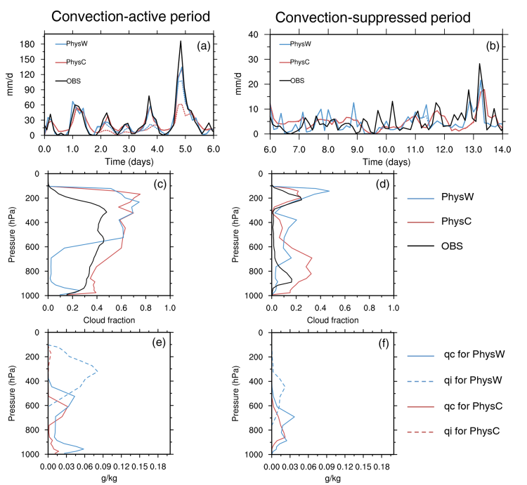

单柱模式
================

单柱模式（GRIST_SCM）运行与三维全球模拟相同的物理过程。GRIST_SCM使用适度计算机资源，提供对物理参数化更改的快速反馈，大多数错误可以通过单柱模式快速检测和诊断。它通常用于物理参数化开发和参数调优测试。它也是一种计算效率高的工具，用于评估不同的方案/模型所刻画的物理过程和相互作用，如热带对流、云反馈和降水日变化等。GRIST_SCM可以分别运行气候物理包（AMIPC-physics）和天气物理包（AMIPW-physics）。

编译和运行单柱模式
-------------------

代码版本: GRIST-A23.6.26 
>>>>>>>>>

编译GRIST主程序
>>>>>>>>>

用户需根据计算机运行环境在编译目录中修改Makefile文件中NETCDF、PNETCDF、LAPACK和METIS _ LIB路径，修改后执行make.sh命令完成编译。

GRIST包含2套物理包(AMIPC和AMIPW)。编译选项分别为：

AMIPC-physics：-O1 -fp-model precise -traceback -r8 -convert big_endian -DSCM_PHYSICS -DAMIPC_PHYSICS

AMIPW-physics：-O1 -fp-model precise -traceback -r8 -convert big_endian -DSCM_PHYSICS -DAMIPW_PHYSICS -DRRTMG_V381 -DUSE_LEAP_YEAR -DSCALE_TBCU

::

     # 进入编译目录
     $ cd /path/to/bld #bld文件路径

     # 修改Makefile中NETCDF、PNETCDF、LAPACK和METIS_LIB路径
     # 编译
     $ sh make.sh

     # 如果编译成功，执行目录中会出现可执行文件: par-grist.exe

运行GRIST_SCM
>>>>>>>>>
以上步骤完成后，即可运行GRIST_SCM。需要指出，所有前处理文件都可以生成后重复使用，如服务器中已存在所需前处理文件，则可以直接进入模式运行阶段

::

     # 进入运行目录
     $ cd /path/to/run #run文件路径

     # 根据用户需求设置grist.nml，并修改gridFilePath对应路径
     # 根据物理包来选择对应grist_amipc_phys.nml或#grist_amipw_phys.nml文件

     # 提交任务
     $ sh run_scm.sh

二进程并行执行文件，运行完成后会生成多个nc文件，即为GRIST_SCM模式运行结果。

参考样例：TWP-ICE （The Tropical WarmPool International Cloud Experiment）
----------------------------

TWP-ICE于2006年1月20日至2月13日在澳大利亚北部达尔文附近(12◦ S, 131◦ E)开展，其数据产品为描述热带云系统及其环境背景和影响的综合数据集，被广泛用于研究与热带对流有关的降雨和云。

运行目录: GRIST_examples/grist_scm_TWP.tgz
>>>>>>>>>

namelist配置参考
>>>>>>>>>

1. grist.nml
::
     day_duration             = 14 #持续时间
     model_timestep           = 1200 #时间步长
     h1_history_freq          = 9 #控制输出文件的时间间隔
     #若采用amipc package，则
     Ntracer                  = 5  
     physpkg                  = ‘AMIPC_PHYSICS’  
     physics_coupling         = ‘P3’ 
     #若采用amipw package，则
     Ntracer                  = 6
     physpkg                  = ‘AMIPW_PHYSICS’
     physics_coupling         = ‘P2’

2. grist_scm.nml
::
     start_ymd                = 20060119 #开始时间
     start_tod                = 0 #开始时间
     scm_lat                  = -11 #纬度
     scm_lon                  = 130 #经度
     scm_test_name            = 'twp06' #试验名称
     scm_relaxation           = .false. #是否打开relaxation

结果示意  
>>>>>>>>>

