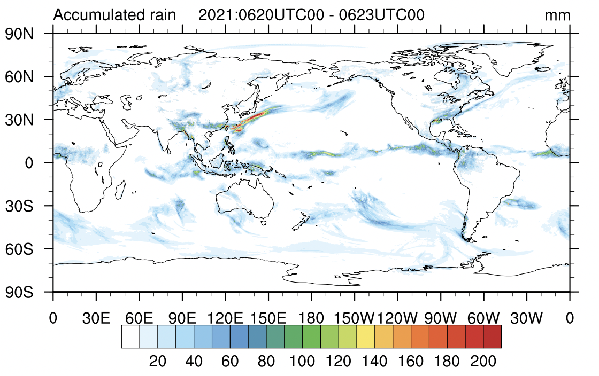

应用实例
=================

所有应用实例数据可从以下链接获取：

https://pan.baidu.com/s/17cPfqL6mr6ZnS1T4D_UpLw?pwd=ffqs

全球120km均匀分辨率气候模拟配置
----------------
试验协议：AMIP

编译选项：

Namelist配置：

外部数据：

结果示意：

参考文献：

全球30km,15km均匀分辨率NWP配置
----------------
试验协议: 业务NWP (冷启动或基于同化)

代码版本: GRIST-A23.6.26

编译选项: -fp-model precise -DRRTMG_V381 -DSPIO -DUSE_HALO2 -DUSE_LEAP_YEAR  -convert big_endian -r8 -DAMIPW_PHYSICS -DAMIPW_CLIMATE -DUSE_NOAHMP -DCDATE

运行目录: 30km: GRIST_examples/grist_amipw_g8.tgz; 15km: GRIST_examples/grist_amipw_g9.tgz

样例示意: 30km:

   

参考文献:

全球5km均匀分辨率非静力云系可分辨模拟配置
----------------
试验协议：DYAMOND

编译选项：

Namelist配置：

外部数据：

结果示意：

参考文献：

全球50-3.5km变分辨率区域公里尺度预测配置
----------------
试验协议：CPTP

编译选项：

Namelist配置：

外部数据：

结果示意：

参考文献：

