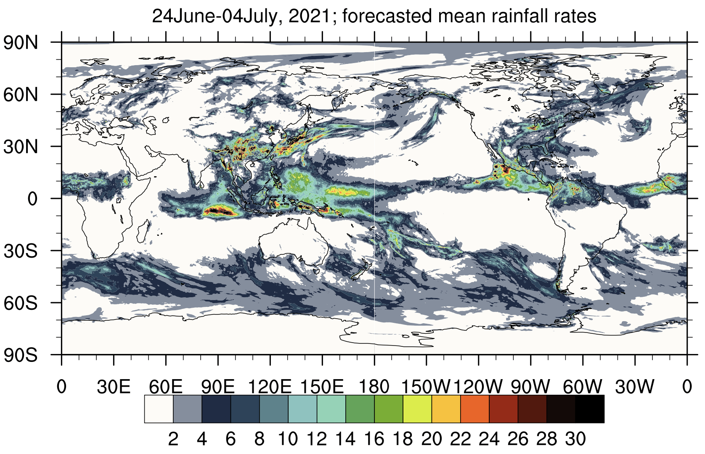
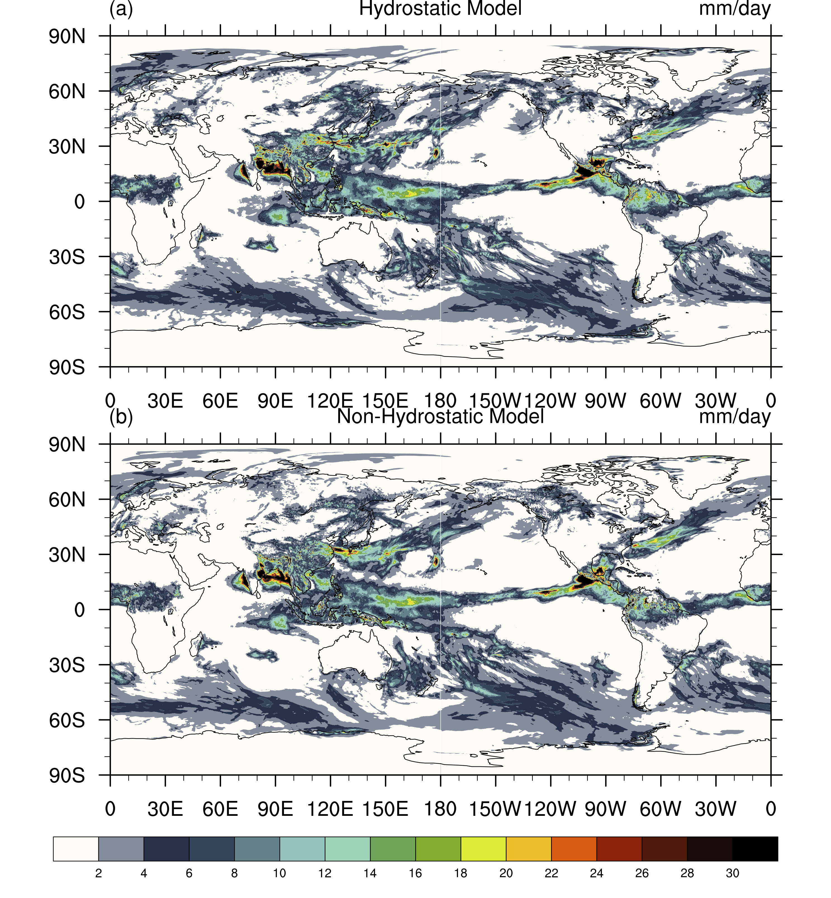

中期天气预报
================   

代码版本：GRIST-A23.6.26 
----------------------------------

本模块所使用的数据均可从以下链接获取：

编译和运行
----------------------------------

编译GRIST_lib库
>>>>>>>>>>>>>>>>>>>>>>>>>>>

首先进入grist_lib库的编译目录：

::

     $ cd ${GRIST_HOME}/src/grist_lib/bld

然后修改Makefile文件中的编译选项：修改 FC、 CC 和 CXX选项来指定 Fortran、 C 和 CXX的编译器(对于 Intel2018版本编译器，示例配置为: FC = mpiifort，CC = mpiicc，CXX = mpiicpc)。然后修改 METIS_LIB 指定 METIS lib 目录。
以上步骤完成后，输入：
::

     $ make lib

等待编译完成。

编译GRIST_AMIPW主程序
>>>>>>>>>>>>>>>>>>>>>>>>>>>

用户需根据计算机运行环境在编译目录中修改Makefile文件中NETCDF、PNETCDF、LAPACK和METIS_LIB路径，修改后执行make.sh命令完成编译。编译选项为：mpifort -fp-model precise -DRRTMG_V381 -DSPIO -DUSE_HALO2 -DUSE_LEAP_YEAR -convert big_endian -r8 -DAMIPW_PHYSICS -DAMIPW_CLIMATE -DUSE_NOAHMP -DCDATE

::

     #进入编译目录
     $ cd ${GRIST_HOME}/bld/build_amipw
     #设置编译选项，修改Makefile中NETCDF、PNETCDF、LAPACK和METIS_LIB路径
     #编译
     $ sh make.sh
     # 如果编译成功，执行目录${EXEDIR}中会出现可执行文件ParGRIST-amipw.exe

模式运行
>>>>>>>>>>>>>>>>>>>>>>>>>>>

以上步骤完成后，即可运行GRIST_AMIPW。模式所需前处理文件请参考初值数据、强迫数据和网格数据这几部分生成或获取，如已制作过前处理文件，则可以直接进入模式运行阶段。

::

     #进入运行目录
     $ cd ${GRIST_HOME}/run/${EXENAME}
     #根据用户需求设置grist.nml与grist_amipw_phys.nml
     #提交任务
     $ sh run_amipw.sh

运行完成后会生成多个nc文件，即为GRIST_AMIPW模式运行结果。

grist.nml的部分设置参考：

::

     #设置积分时长、步长等各类参数
     &ctl_para
     day_duration          = 10
     model_timestep        = 180
     h1_history_freq       = 60
     working_mode          = 'amipw'
     start_ymd             = 20000526
     comm_group_size       = 10
     grid_info             = "G9UR"
     /
     &dycore_para
     nh_dynamics            = .false.
     smooth_topo            = .false.
     nsmooth_topo           = 8
     smooth_type            = 'cellAvg'
     topo_type              = 'static'
     /
     &tracer_para
     ntracer               = 6
     /
     &physics_para
     physpkg               = 'AMIPW_PHYSICS'
     ptend_wind_rk_on      = .true.
     ptend_heat_rk_on      = .true.
     use_som                = .true.

::

     #设置初始场、强迫数据以及模态等参数
     &data_para
     outdir                 = '/Path/to/outdir'
     gridFilePath           = '/Path/to/grid/file'
     gridFileNameHead       = 'grist.grid_file.g9.ccvt'
     staticFilePath         = '/Path/to/static_uniform_g9.nc'
     initialAtmFilePath     = '/Path/to/initialAtmFile'
     initialLndFilePath     = '/Path/to/initialLndFile'
     sstFilePath            = '/Path/to/sstFile'
     initialDataSorc        = 'ERAIP'
     numMonSST              = 1
     sstFile_year_beg       = 2021
     real_sst_style         = 'DAILY'
     sstFileNameHead        = 'realNoMissGFSSstSic20210630.'
     sstFileNameTail        = '.GRIST.2621442.nc'

设置完grist.nml之后，再根据具体需求设置grist_amipw_phys.nml，这里以GRIST_AMIPW使用的默认物理包配置为例：

::

     &wrfphys_para
     wrfphys_cu_scheme     = 'NTDKV381'      #Convection
     wrfphys_cf_scheme     = 'CAM3'          #Cloud fraction
     wrfphys_ra_scheme     = 'RRTMGV381'     #Radiation
     wrfphys_rasw_scheme   = 'RRTMGV381'
     wrfphys_ralw_scheme   = 'RRTMGV381'
     wrfphys_mp_scheme     = 'WSM6V381'      #Microphysics
     wrfphys_bl_scheme     = 'YSUV381'       #Boundary layer
     wrfphys_sf_scheme     = 'SFCLAYV381'    #Surface layer
     wrfphys_lm_scheme     = 'noahmp'        #Land model

结果示意
----------------

图1. 2021年6月24日-7月4日平均降水。 

图2. （a）HDC中期预报平均降水，（b）同（a）但为NDC结果。

参考文献
----------------
陈苏阳，张祎，周逸辉，李晓涵，王一鸣，陈昊明. 2023. GRIST模式夏季气候回报试验中东亚降水季节内特征的评估. 气象学报，81（2）：269-285 doi: 10.11676/qxxb2023.20220120.

备注
----------------
