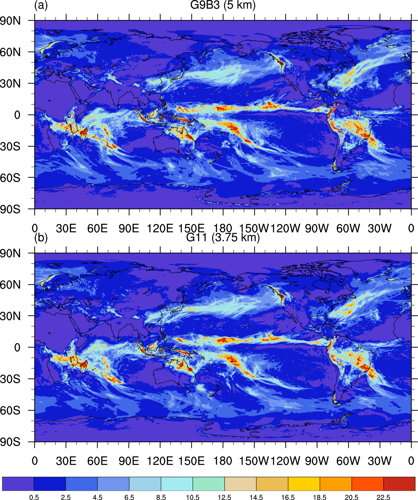

典型应用: 全球风暴解析模拟
================   

代码版本：GRIST-A23.6.26 
----------------------------------

本模块所使用的数据均可从以下链接获取：https://pan.baidu.com/s/14KORa2Y-udMgaHSaXzb6EA?pwd=2l3n

编译和运行
----------------------------------

编译GRIST_lib库
>>>>>>>>>>>>>>>>>>>>>>>>>>>

首先进入grist_lib库的编译目录：

::

     $ cd ${GRIST_HOME}/src/grist_lib/bld

然后修改Makefile文件中的编译选项：修改 FC、 CC 和 CXX选项来指定 Fortran、 C 和 CXX的编译器(对于 Intel2018版本编译器，示例配置为: FC = mpiifort，CC = mpiicc，CXX = mpiicpc)。然后修改 METIS_LIB 指定 METIS lib 目录。
以上步骤完成后，输入：
::

     $ make lib

等待编译完成。

编译GRIST_AMIPW主程序
>>>>>>>>>>>>>>>>>>>>>>>>>>>

用户需根据计算机运行环境在编译目录中修改Makefile文件中NETCDF、PNETCDF、LAPACK和METIS_LIB路径，修改后执行make.sh命令完成编译。编译选项为：mpifort -fp-model precise -DRRTMG_V381 -DSPIO -DUSE_HALO2 -DUSE_LEAP_YEAR -convert big_endian -r8 -DAMIPW_PHYSICS -DAMIPW_CLIMATE -DUSE_NOAHMP -DCDATE

::

     #进入编译目录
     $ cd ${GRIST_HOME}/bld/build_amipw
     #设置编译选项，修改Makefile中NETCDF、PNETCDF、LAPACK和METIS_LIB路径
     #编译
     $ sh make.sh
     # 如果编译成功，执行目录${EXEDIR}中会出现可执行文件ParGRIST-amipw.exe

模式运行
>>>>>>>>>>>>>>>>>>>>>>>>>>>

以上步骤完成后，即可运行GRIST_AMIPW。模式所需前处理文件请参考 :doc:`initial` 、 :doc:`forcing` 和 :doc:`grid` 这几部分生成或获取，如已制作过前处理文件，则可以直接进入模式运行阶段。

::

     #进入运行目录
     $ cd ${GRIST_HOME}/run/${EXENAME}
     #根据用户需求设置grist.nml与grist_amipw_phys.nml
     #提交任务
     $ sh run_amipw.sh

运行完成后会生成多个nc文件，即为GRIST_AMIPW模式运行结果。

grist.nml的部分设置参考：

::

     #设置积分时长、步长等各类参数
     &ctl_para
     day_duration          = 10              #积分总时间
     model_timestep        = 60              #积分步长
     h1_history_freq       = 60              #历史文件输出间隔
     working_mode          = 'amipw'         #工作模式
     start_ymd             = 20000526        #起始日期
     grid_info             = "G9B3UR"        #网格信息
     /
     &dycore_para
     nh_dynamics            = .true.         #静力/非静力开关，k-scale一般采用静力动力内核
     smooth_topo            =.true.          #地形平滑开关，k-scale一般开启改选项
     nsmooth_topo           = 12             #平滑系数
     smooth_type            = 'cellAvg'      #平滑选项
     topo_type              = 'static'       #平滑类型
     smg_coef               = 0.005          
     ko4_coef               = 1e10
     ref_leng               = 3500
     /
     &tracer_para
     ntracer               = 6                #示踪物种类
     tracer_timestep       = 30               #示踪物时间步长
     tracer_hori_timestep  = 30               #水平时间步长
     tracer_vert_timestep  = 30               #垂直时间步长
     /
     &physics_para
     physpkg               = 'AMIPW_PHYSICS'  #物理包
     ptend_wind_rk_on      = .true.           
     ptend_heat_rk_on      = .true.
     use_som               = .false.          #平板海洋模式开关
     ptendSubDiabPhys      = .true.           

::

     #设置初始场、强迫数据以及模态等参数
     &data_para
     outdir                 = '/Path/to/outdir'                    #输出目录
     gridFilePath           = '/Path/to/grid/file'                 #网格文件路径
     gridFileNameHead       = 'grist.grid_file.g9.ccvt'            #网格文件前缀
     staticFilePath         = '/Path/to/static_uniform_g9.nc'      #静态数据文件路径
     large_atm_file_on      = .true.                               #大初始文件开关
     initialAtmUFilePath    = '/Path/to/AtmUFile'                  #U文件路径
     initialAtmVFilePath    = '/Path/to/AtmVFile'                  #V文件路径
     initialAtmTFilePath    = '/Path/to/AtmTFile'                  #T文件路径
     initialAtmQFilePath    = '/Path/to/AtmQFile'                  #Q文件路径
     initialAtmFilePath     = '/Path/to/Atm_singlelevel_File'      #大气单层变量文件路径
     initialLndFilePath     = '/Path/to/LndFile'                   #陆面数据路径
     sstFilePath            = '/Path/to/sstFile'                   #海洋强迫文件路径
     initialDataSorc        = 'ERAIP'                              #初始文件类型
     numMonSST              = 1                                    #海温长度
     sstFile_year_beg       = 2021                                 #初始海温年份
     real_sst_style         = 'DAILY'                              #海温文件类型
     sstFileNameHead        = 'realNoMissGFSSstSic20210630.'       #海温文件前缀
     sstFileNameTail        = '.GRIST.2621442.nc'                  #海温文件后缀
     pardir                 = 'Path/to/partitionfile'              #分区文件
     read_partition         = .true.                               #分区文件开关

设置完grist.nml之后，再根据具体需求设置grist_amipw_phys.nml，这里以GRIST_AMIPW使用的默认物理包配置为例：

::

     &wrfphys_para
     wrfphys_cu_scheme     = 'NTDKV381'      #Convection
     wrfphys_cf_scheme     = 'CAM3'          #Cloud fraction
     wrfphys_ra_scheme     = 'RRTMGV381'     #Radiation
     wrfphys_rasw_scheme   = 'RRTMGV381'
     wrfphys_ralw_scheme   = 'RRTMGV381'
     wrfphys_mp_scheme     = 'WSM6V381'      #Microphysics
     wrfphys_bl_scheme     = 'YSUV381'       #Boundary layer
     wrfphys_sf_scheme     = 'SFCLAYV381'    #Surface layer
     wrfphys_lm_scheme     = 'noahmp'        #Land model
     unuse_cu               = .true.         #对流包开关，在k-scale中可以认为对流是可解析的，因此可以关闭对流包
     step_cu                = 2              #对流时间步长
     step_ra                = 15             #辐射时间不长
     use_gwdo               = .false.        #gwdo开关

结果示意
----------------

图1. 2021年6月24日-7月4日平均降水。 

参考文献
----------------
Zhang, Y., X. Li, Z. Liu, X. Rong, J. Li, Y. Zhou, and S. Chen, (2022), Resolution Sensitivity of the GRIST Nonhydrostatic Model From 120 to 5 km (3.75 km) During the DYAMOND Winter. Earth and Space Science, 9(9), e2022EA002401.doi:https://doi.org/10.1029/2022EA002401.

备注
----------------
